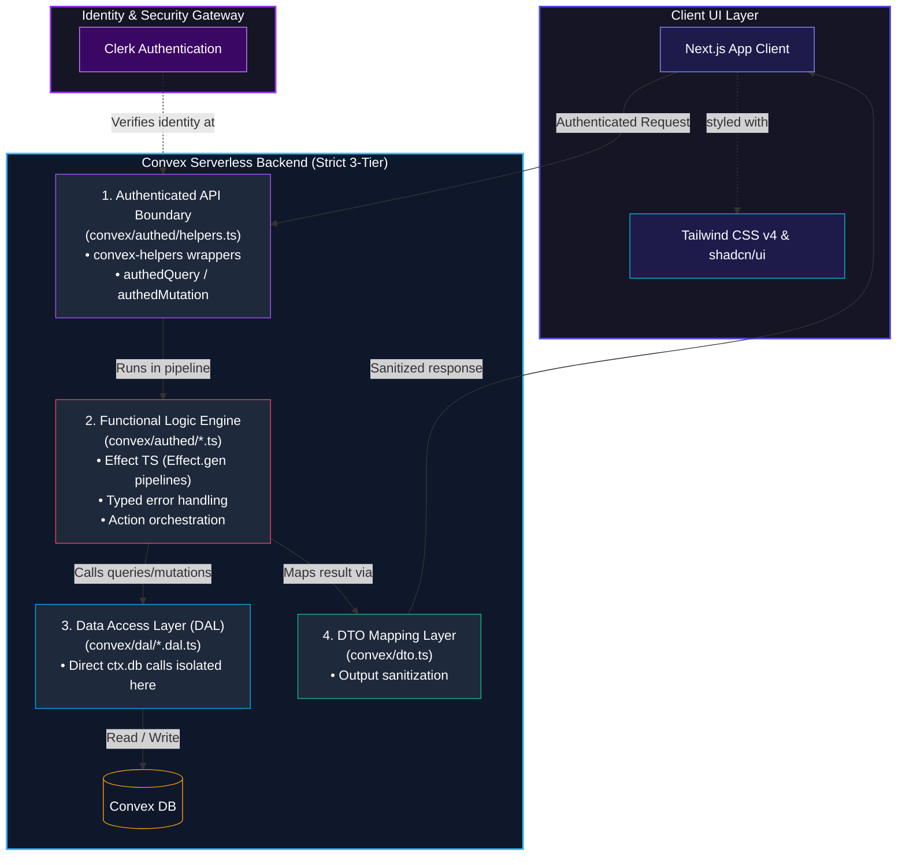
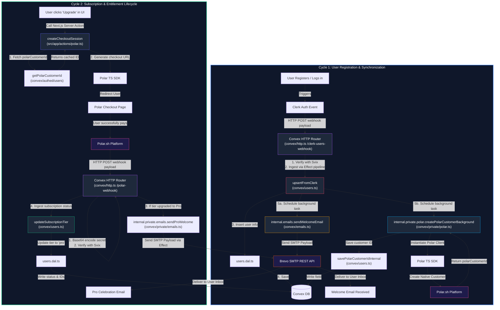

# Promptamist

<p align="center">
  
</p>

<p align="center">
  
</p>

<div align="center">

[](https://pnpm.io/)
[](https://nextjs.org/)
[](https://react.dev/)
[](https://tailwindcss.com/)
[](https://convex.dev/)
[](https://clerk.com/)

</div>

---

Promptamist is a modern, developer-first **AI prompt manager** and **prompt engineering tool** engineered to solve the chaos of losing high-value prompts in cluttered chat logs. Built with rigorous functional type-safety and real-time database sync, it offers a robust platform for creating, versioning, and deploying **reusable Claude prompt templates** and **ChatGPT prompt sharing** flows. Designed for power users, Promptamist provides **type-safe prompt versioning** combined with instant public template sharing under stable, unique slugs.

---

## 🏗️ Architectural Topology & Tech Stack Layering

Promptamist enforces a strict, type-safe architecture to decouple raw database operations from core business workflows, ensuring absolute data consistency, premium styling, and transactional robustness.

### 1. Structural Architecture & Tech Stack Layering

This diagram displays the vertical stack boundaries—tracing standard client operations from UI styles down to the core database engine:



### 2. Event-Driven Lifecycles & External API Webhooks

This diagram maps the horizontal integration pathways—explaining exactly how asynchronous webhooks, email delivery, and customer subscriptions interact across third-party networks:



### Technical Stack & Dependencies

- **Framework**: Next.js `16.2.6` (App Router, RSC, SSR)
- **UI Library**: React & React DOM `19.2.6`
- **Backend & DB**: Convex & `convex-helpers` `^1.39.1`
- **Logic Engine**: Effect (Functional Programming) `4.0.0-beta.52`
- **Authentication**: Clerk (`@clerk/nextjs`, themes) `^7.2.3`
- **Billing**: Polar.sh SDK `^0.47.1` & SVIX `^1.90.0`
- **Styling**: Tailwind CSS v4 & shadcn/ui
- **Validation**: Zod `^4.3.6`
- **Testing**: Vitest `^4.1.5`

---

## 🚀 Quick Starts

### For Non-Coders / Product Teams

1. Access the live deployed application at **[repromptamist.vercel.app](https://repromptamist.vercel.app)**.
2. Sign in via **Clerk** (Google, GitHub, or Passwordless Email).
3. Click **New Prompt**, draft your template using `{{variables}}`, and toggle **Public** to instantly share your prompt link.

### For Developers (Local Setup)

```bash
# 1. Clone and Install
git clone https://github.com/itsyasirkhandev/promptamist-rebuild.git
cd promptamist-rebuild
pnpm install

# 2. Add Environment Variables (.env.local)

# 3. Spin up Developer Environment
# Terminal A (Convex Dev Engine)
npx convex dev
# Terminal B (Next.js client)
pnpm dev

# 4. Verify Code Quality (ESLint + Prettier + TypeScript + Vitest Tests)
pnpm check
```

---

## ⚙️ Environment Configurations

For production deployment, environment variables must be split between **Convex (Backend)** and **Vercel (Frontend)** as follows:

### 🎛️ Convex Backend (Convex Dashboard)

Configure these variables in your **Convex Dashboard (Settings > Environment Variables)**:

- **`CLERK_FRONTEND_API_URL`**: `https://tidy-bullfrog-8.clerk.accounts.dev` (JWT verification issuer domain)
- **`CONVEX_PRIVATE_BRIDGE_KEY`**: Custom shared token to authorize Next.js server actions calling private Convex actions
- **`CLERK_WEBHOOK_SECRET`**: `whsec_...` (Verifies incoming user sync webhooks)
- **`POLAR_WEBHOOK_SECRET`**: `whsec_...` (Verifies incoming subscription status webhooks)
- **`POLAR_ACCESS_TOKEN`**: `polar_oat_...` (Polar authorization credential)
- **`POLAR_ENVIRONMENT`**: `sandbox` or `production` (Determines Polar payment target API)
- **`NEXT_PUBLIC_APP_URL`**: Deployed URL target for checkout redirects
- **`BREVO_API_KEY`**: Brevo SMTP key (if configured for dispatching transactional mail)

### 🌐 Vercel Frontend (Next.js Settings)

Configure these variables in your **Vercel Settings (Settings > Environment Variables)**:

- **`NEXT_PUBLIC_APP_URL`**: `https://repromptamist.vercel.app`
- **`NEXT_PUBLIC_CONVEX_URL`**: `https://[your-project].convex.cloud`
- **`NEXT_PUBLIC_CONVEX_SITE_URL`**: `https://[your-project].convex.site`
- **`NEXT_PUBLIC_CLERK_PUBLISHABLE_KEY`**: `pk_test_...`
- **`CLERK_FRONTEND_API_URL`**: Clerk frontend connection URL
- **`CLERK_SECRET_KEY`**: Secure key for server-side Next.js middleware and API integrations
- **`CONVEX_PRIVATE_BRIDGE_KEY`**: Custom shared key enabling Vercel server actions to invoke Convex
- **`POLAR_ACCESS_TOKEN`**: Polar authentication key for checkout generation
- **`POLAR_ENVIRONMENT`**: sandbox or production payment target
- **`NEXT_PUBLIC_CLERK_SIGN_IN_URL`**: `/sign-in`
- **`NEXT_PUBLIC_CLERK_SIGN_UP_URL`**: `/sign-up`
- **`NEXT_PUBLIC_CLERK_SIGN_IN_FALLBACK_REDIRECT_URL`**: `/prompts`
- **`NEXT_PUBLIC_CLERK_SIGN_UP_FALLBACK_REDIRECT_URL`**: `/prompts`

---

## 🎯 Contributor Expectations & Guardrails

We enforce strict coding and layout principles. Pull Requests violating these guidelines will be rejected.

### 1. Strict 3-Tier Backend Layering

> [!IMPORTANT]
> Raw database operations are forbidden outside the Data Access Layer (DAL). Do not bypass layers.

- **Data Access Layer (DAL)**: All direct `ctx.db` calls must reside inside `convex/dal/` (e.g. `prompts.dal.ts`, `users.dal.ts`).
- **Effect Logic Engine**: Real mutations/queries execute inside functional `Effect.gen` pipelines caught by `runEffect` (`convex/effect.ts`), raising typed errors (`errors.ts`).
- **Authenticated API Boundary**: Client functions must be wrapped using custom `authedQuery`, `authedMutation`, or `authedAction` wrappers (`convex/authed/helpers.ts`).
- **Data Transfer Objects (DTO)**: Results returned to the client must pass through DTO mappers (`convex/dto.ts`) to strip sensitive credentials.

### 2. Design System Limitations (`DESIGN_GUIDELINES.md`)

> [!WARNING]
> Do not introduce custom font sizes, spacing increments, or arbitrary colors.

- **Typography**: Strictly limited to **4 font sizes** and **2 font weights** (Regular & Semibold) for clean hierarchy.
- **Spacing**: Rigid **8pt grid system**. Margins, padding, gaps, and heights must be divisible by `8` or `4`.
- **Color Balance**: A clean **60/30/10 distribution** using modern, perceptually uniform **OKLCH variables**.

---

## 🤝 Socials & Project Support

- 🌟 **Star the Repository**: Show your appreciation on GitHub!
- 💼 **Connect on LinkedIn**: Professional networking and updates at [Yasir Khan](https://www.linkedin.com/in/connectyasir/).
- 🐦 **Follow the Creator**: Follow updates and announcements on X/Twitter at [@withyasirkhan](https://x.com/withyasirkhan).
