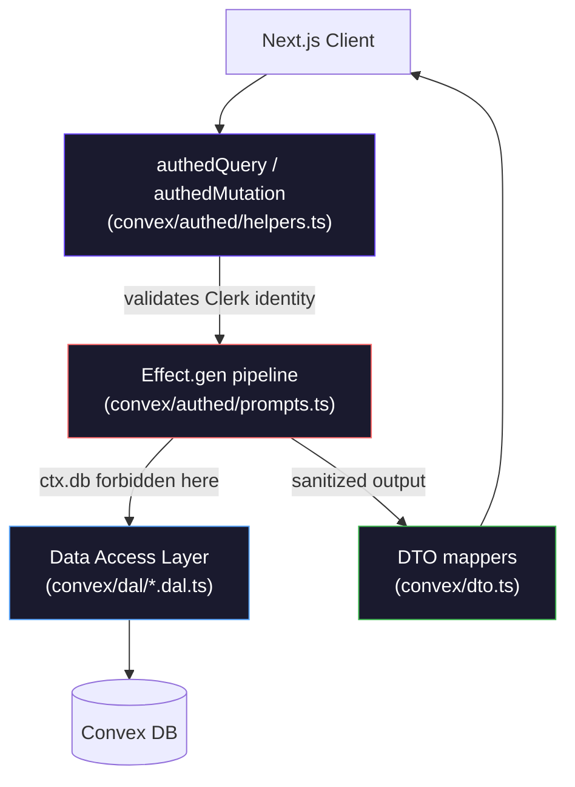

# Promptamist

<p align="center">
  
</p>

<p align="center">
  
</p>

<div align="center">

[](https://pnpm.io/)
[](https://nextjs.org/)
[](https://react.dev/)
[](https://tailwindcss.com/)
[](https://convex.dev/)
[](https://clerk.com/)
[](LICENSE)

</div>

---

## [01] Backend Architecture

The backend is built on three enforced layers: a strict **Data Access Layer**, an **Effect-based logic engine**, and **authenticated API boundaries**.



### Data Access Layer (`convex/dal/`)

All raw `ctx.db` calls are strictly isolated here. Business logic and mutations **never call `ctx.db` directly**. Two DAL files exist:

- **`prompts.dal.ts`** — operations on the `prompts` table
- **`users.dal.ts`** — operations on the `users` table

Enforced naming convention:

| Prefix    | Semantics                                |
| :-------- | :--------------------------------------- |
| `find*`   | Returns a single `Doc \| null`           |
| `list*`   | Returns a `Doc[]` array                  |
| `insert*` | Creates a new document, returns its `Id` |
| `patch*`  | Partial update on existing document      |
| `delete*` | Removes a document by `Id`               |

### Effect Logic Engine (`convex/effect.ts`)

All mutations and queries execute inside an `Effect.gen` pipeline. The `runEffect` wrapper converts Effect exits into Convex-compatible throws:

- **Typed errors** (`Unauthorized`, `NotFound`, `ValidationError`, `InternalError`) are defined with `Schema.TaggedErrorClass` in `convex/errors.ts` and propagated as structured `ConvexError` payloads.
- **Defects** (unexpected throws) are caught, logged, and re-thrown as a generic `InternalError`.

```ts
// Pattern used in every mutation/query handler
return await runEffect(
  Effect.gen(function* () {
    yield* validatePromptArgs(args);
    const userId = yield* getUserId(ctx, ctx.identity.subject);
    // ... DAL calls via Effect.promise(...)
  }),
);
```

### Authenticated API Boundary (`convex/authed/helpers.ts`)

All client-exposed functions are wrapped with `authedQuery`, `authedMutation`, or `authedAction` — custom Convex function wrappers built with `convex-helpers`. Each wrapper:

1. Calls `ctx.auth.getUserIdentity()` and throws `Unauthorized` if no session exists.
2. Merges the verified `identity` object into `ctx`, making it available as `ctx.identity` downstream.

```ts
export const authedMutation = customMutation(mutation, {
  input: async (ctx) => {
    const identity = await validateIdentity(ctx); // throws if unauthenticated
    return { ctx: { ...ctx, identity }, args: {} };
  },
});
```

---

## [02] Core Backend Functionality

### Prompts Management (`convex/authed/prompts.ts`)

| Function         | Type     | Description                                                                         |
| :--------------- | :------- | :---------------------------------------------------------------------------------- |
| `createPrompt`   | Mutation | Validates args, enforces 50-prompt free-tier limit, inserts via DAL, updates stats. |
| `updatePrompt`   | Mutation | Patches prompt via DAL, regenerates slug on public transition, diffs stat changes.  |
| `deletePrompt`   | Mutation | Ownership-checks prompt, deletes via DAL, decrements stats atomically.              |
| `getPrompts`     | Query    | Lists all prompts for the caller; maps each result through `toPromptDTO`.           |
| `getPromptById`  | Query    | Fetches a single prompt with ownership enforcement; returns `toPromptDTO`.          |
| `getPromptStats` | Query    | Returns denormalized counts + `newThisWeek` (live count) + `lastActivityAt`.        |

### Denormalized User Stats

`users.promptStats` (`{ total, templates, public }`) is updated atomically on every create, update, and delete mutation via the `updateUserPromptStats` helper (`convex/authed/promptHelpers.ts`). This avoids a full table scan on every stats query. The `newThisWeek` field is computed live using `listRecentPromptsByUser` (indexed query with `_creationTime` bound).

### Slug Generation (`convex/authed/promptHelpers.ts`)

When a prompt transitions to `isPublic: true`, `generateUniqueSlug` is called:

1. Derives a base slug from the title (lowercase, hyphens, strips leading/trailing hyphens).
2. Appends a 6-character random `Math.random().toString(36)` suffix.
3. Checks uniqueness via `isSlugTaken` (DAL: `by_publicSlug` index). Retries up to 5 times.
4. Falls back to a `Date.now().toString(36)` suffix on exhaustion.

Slugs are never regenerated once assigned, preserving stable public URLs across subsequent edits.

### Data Transfer Objects (`convex/dto.ts`)

All query return values pass through a DTO mapper before reaching the client. Key rules enforced by the mappers:

- **`toPromptDTO`** — strips `userId`; only exposes `publicSlug` when `isPublic === true`.
- **`toUserDTO`** — strips `clerkId`, `polarCustomerId`, `polarSubscriptionId`.
- **`toPublicPromptDTO`** — used by the unauthenticated shared-prompt route; strips all user-linking fields.

---

## [03] Infrastructure Stack

| Layer            | Implementation          | Notes                                                 |
| :--------------- | :---------------------- | :---------------------------------------------------- |
| **Interface**    | Next.js 16              | App Router, RSC, SSR                                  |
| **Persistence**  | Convex                  | Document-relational, real-time subscriptions          |
| **Logic Engine** | Effect 4 beta           | `Schema.TaggedErrorClass`, `Effect.gen`, `runEffect`  |
| **Identity**     | Clerk                   | JWT validation via `ctx.auth`, SVIX-verified webhooks |
| **Billing**      | Polar (`@polar-sh/sdk`) | Subscription tier stored on user document             |
| **Design**       | Tailwind 4 + shadcn/ui  | OKLCH palette, Radix primitives                       |

---

## [04] Local Deployment

### 1. Clone & Install

```bash
git clone https://github.com/your-username/promptamist.git
cd promptamist
pnpm install
```

### 2. Environment Variables

Create `.env.local`:

```env
# Clerk
NEXT_PUBLIC_CLERK_PUBLISHABLE_KEY=pk_test_...
CLERK_SECRET_KEY=sk_test_...
CLERK_WEBHOOK_SECRET=whsec_...

# Convex
NEXT_PUBLIC_CONVEX_URL=https://...
```

### 3. Run

```bash
# Terminal A — Convex dev server
npx convex dev

# Terminal B — Next.js dev server
pnpm dev
```

---

## [05] Project Topology

```text
promptamist/
├── convex/
│   ├── authed/
│   │   ├── helpers.ts          # authedQuery / authedMutation / authedAction wrappers
│   │   ├── prompts.ts          # Client-exposed queries and mutations
│   │   └── promptHelpers.ts    # Slug generation, ownership check, stats updater
│   ├── dal/
│   │   ├── prompts.dal.ts      # All ctx.db access for the prompts table
│   │   └── users.dal.ts        # All ctx.db access for the users table
│   ├── private/                # Internal backend-only functions
│   ├── dto.ts                  # DTO mappers (toPromptDTO, toUserDTO, toPublicPromptDTO)
│   ├── effect.ts               # runEffect — Effect → ConvexError bridge
│   ├── errors.ts               # TaggedErrorClass definitions
│   ├── schema.ts               # Convex schema (users, prompts tables)
│   └── validators.ts           # Shared Convex value validators
└── src/
    ├── app/                    # Next.js App Router pages and layouts
    ├── components/             # UI primitives and composite blocks
    └── lib/                    # Client-side utilities
```

---

## [06] Code Quality

```bash
pnpm lint       # ESLint
pnpm format     # Prettier
pnpm typecheck  # tsc --noEmit
```

---

## [07] License

Released under the [MIT License](LICENSE).
