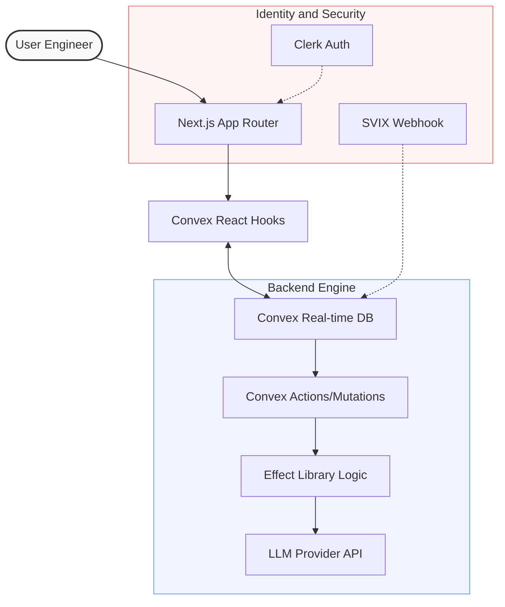

# Promptamist

<p align="center">
  
</p>

<p align="center">
  
</p>

<div align="center">

[](https://pnpm.io/)
[](https://nextjs.org/)
[](https://react.dev/)
[](https://tailwindcss.com/)
[](https://convex.dev/)
[](https://clerk.com/)
[](LICENSE)

</div>

---

## [01] Architectural Flow

Promptamist utilizes a high-performance reactive stack to manage prompt lifecycles from definition to execution.



---

## [02] Core Capabilities

### Prompt Architecture

- **Dynamic Variable Injection**: Schema-aware support for `Text`, `Number`, `Choices`, and `Lists`.
- **Structural Integrity**: Strict versioning and draft/publish workflows.
- **Live Context Rendering**: Real-time evaluation of prompt templates with active variables.

### Distribution & Lifecycle

- **Semantic Routing**: Human-readable, SEO-optimized slugs for prompt discovery.
- **Collaborative Workspaces**: Fine-grained visibility controls (Public vs. Private).
- **Metadata Engine**: Robust tagging and categorization for large-scale prompt libraries.

### Security Infrastructure

- **Unified Identity**: Enterprise-grade authentication via Clerk integration.
- **Edge Security**: SVIX-verified webhook synchronization for user data integrity.
- **Contextual Access**: Server-side permission enforcement on all data operations.

---

## [03] Infrastructure Stack

| Layer            | Implementation | Strategic Rationale                                     |
| :--------------- | :------------- | :------------------------------------------------------ |
| **Interface**    | Next.js 16     | SSR-first performance and optimized asset delivery.     |
| **Persistence**  | Convex         | Document-relational storage with native real-time sync. |
| **Logic Engine** | Effect         | Type-safe error handling and functional composition.    |
| **Identity**     | Clerk          | Decoupled auth management and multi-session support.    |
| **Design**       | Tailwind 4     | JIT-compiled utility-first styling with OKLCH support.  |
| **Components**   | shadcn/ui      | Radix-based accessible UI primitives.                   |

---

## [04] Local Deployment

### 1. Environment Initialization

```bash
git clone https://github.com/your-username/promptamist.git
cd promptamist
pnpm install
```

### 2. Service Configuration

Define local environment variables in `.env.local`:

```env
# Identity Provider
NEXT_PUBLIC_CLERK_PUBLISHABLE_KEY=pk_test_...
CLERK_SECRET_KEY=sk_test_...

# Backend Sync
NEXT_PUBLIC_CONVEX_URL=https://...
CLERK_WEBHOOK_SECRET=whsec_...
```

### 3. Execution

```bash
# Terminal A: Background Services
npx convex dev

# Terminal B: Development Server
pnpm dev
```

---

## [05] Project Topology

```text
promptamist/
├── convex/             # Database schema, mutations, and actions
│   ├── authed/         # Authenticated API boundary
│   ├── private/        # Internal backend utilities
│   └── schema.ts       # Type-safe database definitions
├── src/
│   ├── app/            # Application layouts and page routing
│   ├── components/     # UI primitives and composite blocks
│   ├── lib/            # Effect logic and domain utilities
│   └── proxy.ts        # Client-side API orchestration
└── docs/               # Technical specifications
```

---

## [06] Governance & Quality

- **Linting**: Strict ESLint configuration for code consistency.
- **Types**: 100% TypeScript coverage with inferred API types.
- **Formatting**: Automated Prettier enforcement.
- **Testing**: Vitest suite for core logic validation.

---

## [07] License

Released under the [MIT License](LICENSE).
